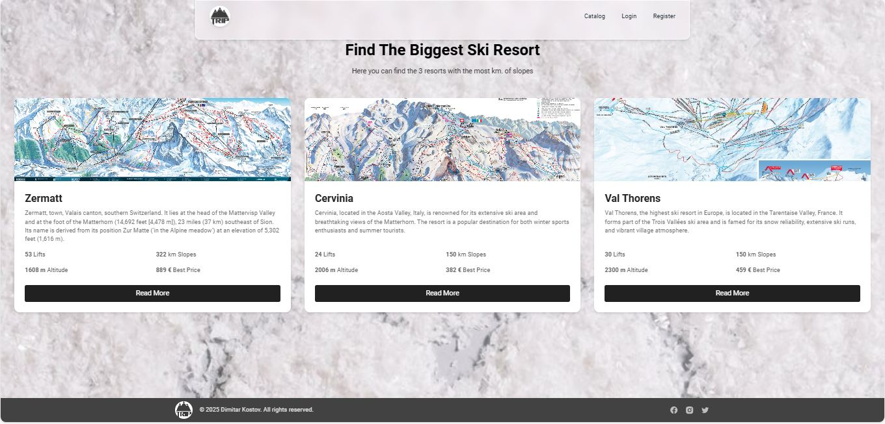
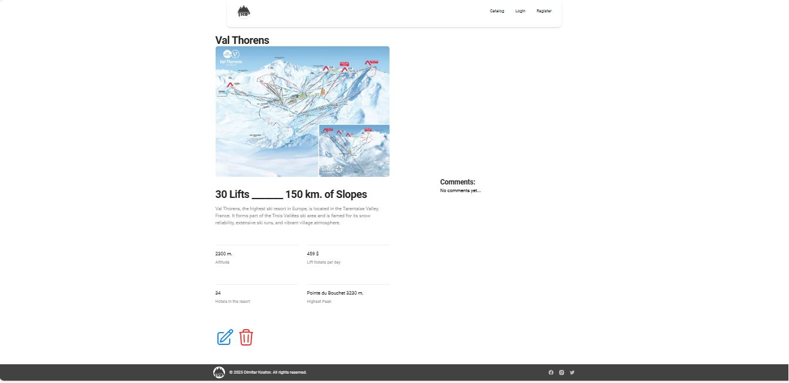
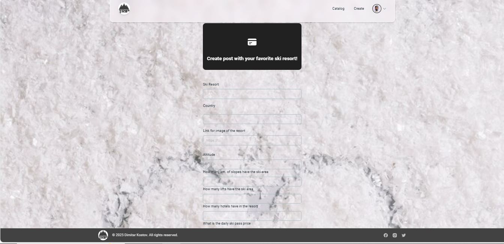
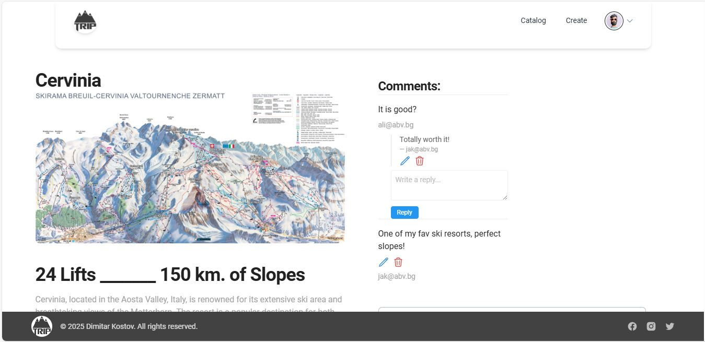

# Ski Resorts Platform

## Project Description

Built as a modern Single Page Application (SPA) with **React** and client-side routing, this front-end web app allows users to seamlessly share their ski resort experiences—with fast navigation and no full-page reloads. Users can perform full **CRUD operations** on their own posts, leave comments on others' posts, and reply to any comment. The responsive UI is styled using **Tailwind CSS** and **CSS Modules**, with state and data flow managed via a service-layer abstraction.

## Features

* **Searching includes all ski resorts on the planet:** Full info about each ski resort, including the number of kilometers of ski slopes, altitude, number of lifts, highest peak, number of hotels in the resort, and more.

* **Creating new ski resorts if missing from the platform:** Users can add new ski resorts with detailed information and upload a ski map.

* **Commenting:** Users can share their own experiences by leaving comments on each ski resort, and can also reply to other users' comments.

* **Pre-loaded data:** The platform comes with pre-loaded ski resort data to ensure a smooth user experience from the start.

## Technology Stack

- **Language:** HTML, JavaScript
- **Libraries and Frameworks:**
  -  React
  -  Vite
  -  TailwindCS 

## 📸 Screenshots

### 🏔️ Home Page  

### 🎿 Catalog

### 🗺️ Resort Detail View  

### ➕ Add New Resort Form  

### 💬 Comments and Replies  

